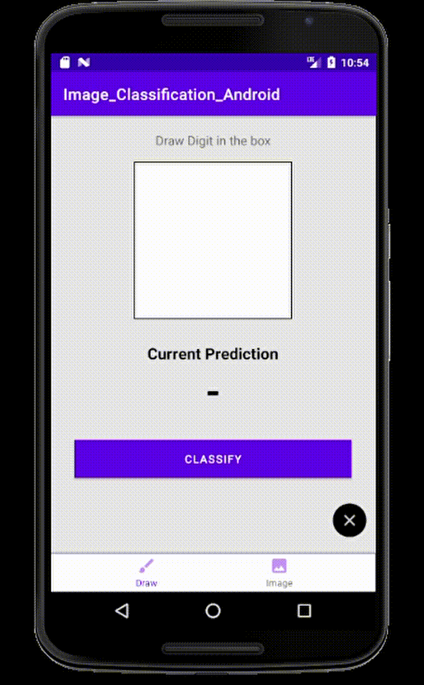

# image_classification_on_Android
Image Classification with MNIST dataset on Android to detect one-digit numbers

## Structure
Machine Learning:
- Use Tensorflow to train digits then convert to TFLite to use for display confidence score in Android

Android: Consists 2 part
- Draw part: Use FingerPaintView to draw digits and 2 buttons to show predict score and clear I/O
- Image part: Upload image and predict

## Result

## Sources
- Inspire from [AladdinPersson](https://github.com/aladdinpersson/HelloMnist)
- Draw: https://github.com/nex3z/tflite-mnist-android