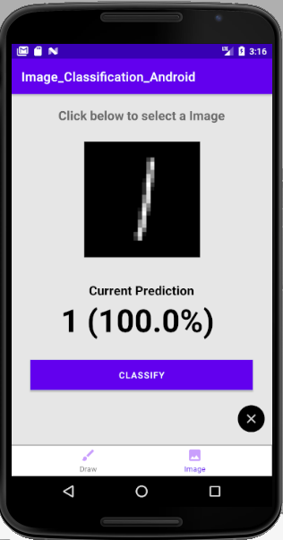
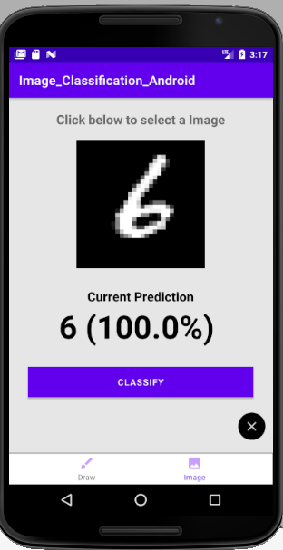

# image_classification_on_Android
Image Classification with MNIST dataset on Android to detect one-digit numbers
Can add more interesting models to app in the future

## Languages to use
- Java
- Python (Tensorflow)

## Structure
Machine Learning:
- Use Tensorflow to train digits then convert TF model to TFLite model for classification task in Android

Android: Consists 2 parts
- Draw part: Use FingerPaintView to draw digits and 2 buttons to show predict score and clear I/O
- Image part: Upload image and 2 buttons to show predict score and clear I/O

## Result

## Sources
- Inspired from [AladdinPersson](https://github.com/aladdinpersson/HelloMnist)
- Draw with Fingerpaint: [nex3z](https://github.com/nex3z/tflite-mnist-android)
- PreprocessImage: [vasugargofficial](https://github.com/vasugargofficial/Image-Classification-Mobilenet-AndroidDemo/blob/master/app/src/main/java/com/example/imageclassificationdemo/MainActivity.java)
